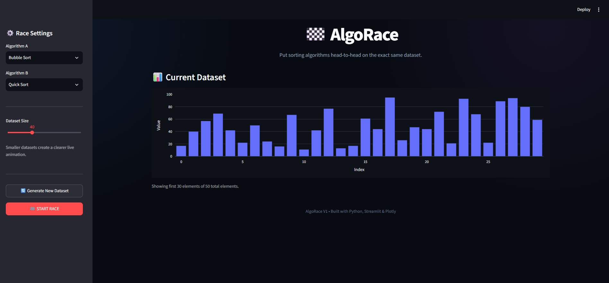

# 🏁 AlgoRace

> **Same data. Different algorithms. One race.**

AlgoRace is an interactive sorting algorithm visualization and benchmarking tool built with **Python, Streamlit, and Plotly**.

It puts two sorting algorithms head-to-head on the **same dataset** and visualizes their sorting process while comparing execution time, comparisons, and swaps/moves.

---

## 🚀 What is AlgoRace?

Sorting algorithms solve the same problem in different ways.

AlgoRace makes those differences visible.

Choose any two algorithms, generate a dataset, and start the race. The application runs both algorithms on the same input and lets you observe their behavior side-by-side.

### Currently supported

- 🔵 Bubble Sort
- 🟣 Selection Sort
- 🟢 Insertion Sort
- 🟡 Merge Sort
- 🟠 Quick Sort

---

## ✨ Features

- 🏁 Head-to-head algorithm races
- ⚡ Live sorting visualization
- 📊 Interactive dataset visualization
- ⏱️ Execution-time benchmarking
- 🔢 Comparison counting
- 🔄 Swap/move counting
- 🏆 Automatic winner detection
- 🎚️ Adjustable dataset size
- 🔄 Random dataset generation
- 📈 Side-by-side performance comparison
- 🌙 Dark developer-style interface

---

## 🧠 Algorithms

| Algorithm | Average Time | Worst Time | Core Idea |
|---|---:|---:|---|
| Bubble Sort | O(n²) | O(n²) | Repeatedly compares adjacent elements |
| Selection Sort | O(n²) | O(n²) | Repeatedly selects the minimum element |
| Insertion Sort | O(n²) | O(n²) | Inserts each element into its sorted position |
| Merge Sort | O(n log n) | O(n log n) | Divide, sort, and merge |
| Quick Sort | O(n log n) | O(n²) | Partition around a pivot |

> The exact execution time shown by the application depends on the machine and runtime environment. Operation counts and Big-O complexity provide a more stable basis for algorithm comparison.

---

## 🏁 How the Race Works

Both algorithms receive the **same randomly generated dataset**.

For example:

```text
[59, 20, 20, 11, 10, 94, 86, 51, 13, 89]
```

Each algorithm works on its own copy of that dataset.

AlgoRace records:

```text
Execution Time
Comparisons
Swaps / Moves
Sorting Progress
```

The algorithms are then presented side-by-side so their different approaches can be observed visually.

---

## 📊 Metrics

### ⏱️ Execution Time

Approximate time required for the algorithm to sort the dataset during the benchmark run.

### 🔢 Comparisons

Number of element comparisons performed by the implementation.

### 🔄 Swaps / Moves

Recorded element swaps or movements performed while sorting.

### 🏆 Winner

The application compares the measured execution times and identifies the faster benchmark result.

Because very small execution times can vary between runs, the winner should be interpreted together with operation counts and theoretical complexity.

---

## 🎯 Why I Built It

Algorithm complexity is often introduced through expressions such as:

```text
O(n²)
O(n log n)
```

But understanding what those differences actually mean can be difficult from notation alone.

AlgoRace turns these concepts into an interactive visual experience.

Instead of simply reading about sorting algorithms, users can **watch different approaches process the same data and compare their behavior**.

---

## 🛠️ Tech Stack

- 🐍 **Python**
- ⚡ **Streamlit**
- 📊 **Plotly**

### Development principles

- ₹0 development cost
- No paid APIs
- No external database
- Lightweight local application
- Focused V1 scope

---

## 📂 Project Structure

```text
AlgoRace/
│
├── app.py
├── algorithms.py
├── requirements.txt
├── README.md
└── .gitignore
```

### `app.py`

Contains:

- Streamlit interface
- Race controls
- Dataset generation
- Live visualization
- Benchmark results
- Performance comparison

### `algorithms.py`

Contains:

- Sorting implementations
- Benchmarking functions
- Step-by-step sorting generators
- Algorithm registries

---

## ▶️ Run Locally

### 1. Clone the repository

```bash
git clone https://github.com/palashgoyalatwork/AlgoRace.git
cd AlgoRace
```

### 2. Create a virtual environment

#### Windows

```powershell
python -m venv .venv
.venv\Scripts\activate
```

#### macOS / Linux

```bash
python3 -m venv .venv
source .venv/bin/activate
```

### 3. Install dependencies

```bash
pip install -r requirements.txt
```

### 4. Run the application

```bash
streamlit run app.py
```

The application will open in your browser at the local Streamlit address.

---

## 🎮 How to Use

1. Select **Algorithm A**
2. Select **Algorithm B**
3. Choose the dataset size
4. Click **START RACE**
5. Watch both algorithms sort the dataset
6. Compare their operation counts
7. Review the final benchmark
8. Check the winning algorithm

For the clearest live visualization, smaller datasets are recommended.

---

## 💡 Example

A simple race could be:

```text
Bubble Sort  🆚  Quick Sort
```

Both receive the same input:

```text
[7, 3, 8, 2, 5]
```

They eventually produce:

```text
[2, 3, 5, 7, 8]
```

But the route they take to reach the result is different.

That difference is what AlgoRace is designed to visualize.

---

## 📸 Screenshots

Add project screenshots here after capturing the final application.

Example:

```markdown

```

---

## 📌 Version

### AlgoRace V1

V1 is intentionally focused on one core objective:

> **Make sorting algorithm behavior visual, interactive, and comparable.**

The project has a deliberately limited scope so the core experience can remain simple and complete.

---

## 🔮 Future Possibilities

Potential future experiments could include:

- Additional sorting algorithms
- Searching algorithm visualization
- Custom dataset upload
- More benchmarking statistics
- Algorithm complexity explanations
- Visualization speed controls

These are **not part of the current V1 scope**.

---

## 👨‍💻 Author

### Palash Goyal

Independent developer and student exploring:

- Algorithms & Data Structures
- Python Development
- Data Visualization
- Interactive Applications
- Software Engineering

---

## 📄 License

This project is open source and available for learning and experimentation.

---

<p align="center">
  <b>🏁 Same data. Different algorithms. One race.</b>
</p>
